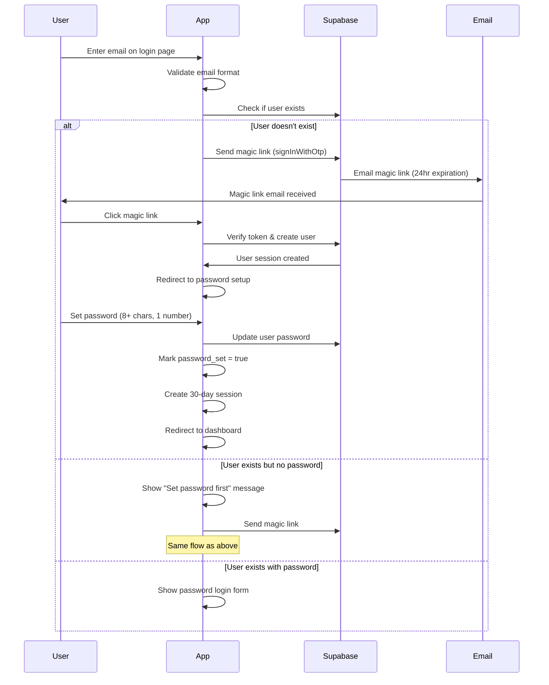
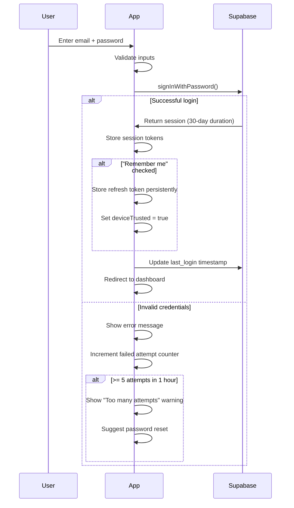
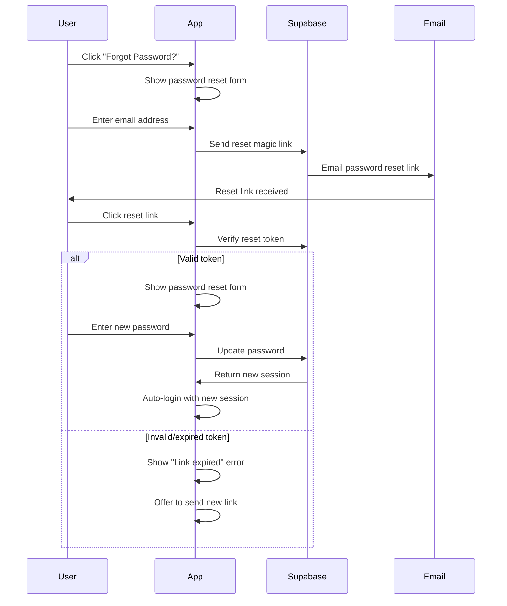

# Authentication Flow Specification

## Overview

The authentication system uses a hybrid approach optimized for long tournament events (3+ hours) where organizers need persistent access without frequent re-authentication. The system combines magic link security for initial setup with convenient password authentication for subsequent logins.

## Authentication Architecture

### State Management
```typescript
interface AuthState {
  user: User | null;
  session: Session | null;
  loading: boolean;
  initialized: boolean;
  passwordSet: boolean;
  sessionTimeRemaining: number; // milliseconds
  deviceTrusted: boolean; // "Remember me" status
}

interface User {
  id: string;
  email: string;
  display_name: string;
  role: 'organizer' | 'admin';
  password_set: boolean;
  last_login: Date;
  created_at: Date;
}

interface Session {
  access_token: string;
  refresh_token: string;
  expires_at: Date;
  user: User;
  provider_token?: string;
}
```

## Authentication Flows

### 1. First-Time Organizer Registration



### 2. Returning Organizer Login



### 3. Password Recovery



## Session Management

### Session Lifecycle

1. **Session Creation**
   - Duration: 30 days (2,592,000 seconds)
   - Storage: SessionStorage for access token, LocalStorage for refresh token (if "Remember me")
   - Auto-refresh: When < 1 hour remains

2. **Session Validation**
   ```typescript
   async function validateSession(): Promise<boolean> {
     const session = await supabase.auth.getSession();
     
     if (!session?.data?.session) {
       return false;
     }
     
     const expiresAt = new Date(session.data.session.expires_at * 1000);
     const now = new Date();
     const timeRemaining = expiresAt.getTime() - now.getTime();
     
     // Auto-refresh if less than 1 hour remains
     if (timeRemaining < 3600000) {
       const { data, error } = await supabase.auth.refreshSession();
       if (error) {
         await handleSessionExpiry();
         return false;
       }
       // Update stored tokens
       updateStoredSession(data.session);
     }
     
     return true;
   }
   ```

3. **Session Refresh Strategy**
   ```typescript
   // Automatic refresh intervals
   const REFRESH_INTERVALS = {
     CHECK_INTERVAL: 5 * 60 * 1000, // Check every 5 minutes
     REFRESH_THRESHOLD: 60 * 60 * 1000, // Refresh when < 1 hour left
     IDLE_TIMEOUT: 7 * 24 * 60 * 60 * 1000 // 7 days idle timeout
   };
   
   function startSessionMonitoring() {
     setInterval(async () => {
       const isValid = await validateSession();
       if (!isValid) {
         await handleSessionExpiry();
       }
     }, REFRESH_INTERVALS.CHECK_INTERVAL);
   }
   ```

## Route Protection

### Route Guard Implementation
```typescript
interface ProtectedRouteProps {
  children: React.ReactNode;
  requireAuth?: boolean;
  requiredRole?: 'organizer' | 'admin';
  fallback?: React.ReactNode;
}

function ProtectedRoute({ 
  children, 
  requireAuth = true, 
  requiredRole = 'organizer',
  fallback 
}: ProtectedRouteProps) {
  const { user, session, loading, initialized } = useAuth();
  const navigate = useNavigate();
  const location = useLocation();
  
  useEffect(() => {
    if (!initialized || loading) return;
    
    if (requireAuth && !session) {
      // Store intended destination
      sessionStorage.setItem('redirectAfterLogin', location.pathname);
      navigate('/login', { replace: true });
      return;
    }
    
    if (requiredRole && user?.role !== requiredRole && user?.role !== 'admin') {
      navigate('/', { replace: true });
      return;
    }
  }, [user, session, loading, initialized, requireAuth, requiredRole]);
  
  if (!initialized || loading) {
    return fallback || <LoadingSpinner />;
  }
  
  if (requireAuth && !session) {
    return null; // Navigation will occur in useEffect
  }
  
  return <>{children}</>;
}

// Usage in router
const router = createBrowserRouter([
  {
    path: '/',
    element: <Layout />,
    children: [
      { path: '/', element: <HomePage /> },
      { path: '/events', element: <EventsPage /> },
      { path: '/event/:id', element: <EventDetailPage /> },
      { path: '/login', element: <LoginPage /> },
      {
        path: '/admin',
        element: <ProtectedRoute><AdminLayout /></ProtectedRoute>,
        children: [
          { path: 'create-event', element: <CreateEventPage /> },
          { path: 'manage-event/:id', element: <ManageEventPage /> },
          { path: 'settings', element: <SettingsPage /> }
        ]
      }
    ]
  }
]);
```

## Error Handling

### Authentication Errors
```typescript
interface AuthError {
  code: string;
  message: string;
  details?: any;
}

const AUTH_ERROR_MESSAGES = {
  'invalid_credentials': 'Invalid email or password',
  'email_not_confirmed': 'Please check your email and click the confirmation link',
  'too_many_requests': 'Too many login attempts. Please wait before trying again',
  'weak_password': 'Password must be at least 8 characters with one number',
  'user_not_found': 'No account found with this email address',
  'expired_token': 'This link has expired. Please request a new one',
  'network_error': 'Connection problem. Please check your internet and try again'
};

function handleAuthError(error: AuthError): string {
  return AUTH_ERROR_MESSAGES[error.code] || 'Something went wrong. Please try again.';
}
```

### Session Expiry Handling
```typescript
async function handleSessionExpiry() {
  // Clear all stored auth data
  await supabase.auth.signOut();
  sessionStorage.removeItem('supabase.auth.token');
  localStorage.removeItem('supabase.auth.token');
  
  // Store current location for redirect after login
  const currentPath = window.location.pathname;
  if (currentPath !== '/' && currentPath !== '/login') {
    sessionStorage.setItem('redirectAfterLogin', currentPath);
  }
  
  // Show user-friendly message
  toast.warning('Your session has expired. Please log in again.');
  
  // Redirect to login
  window.location.href = '/login';
}
```

## Security Considerations

### Password Requirements
```typescript
interface PasswordValidation {
  minLength: number;
  requireNumber: boolean;
  requireUppercase: boolean;
  requireSpecialChar: boolean;
  maxLength: number;
}

const PASSWORD_RULES: PasswordValidation = {
  minLength: 8,
  requireNumber: true,
  requireUppercase: false, // Simplified for target audience
  requireSpecialChar: false,
  maxLength: 128
};

function validatePassword(password: string): string[] {
  const errors: string[] = [];
  
  if (password.length < PASSWORD_RULES.minLength) {
    errors.push(`Password must be at least ${PASSWORD_RULES.minLength} characters`);
  }
  
  if (PASSWORD_RULES.requireNumber && !/\d/.test(password)) {
    errors.push('Password must contain at least one number');
  }
  
  if (password.length > PASSWORD_RULES.maxLength) {
    errors.push(`Password must be no more than ${PASSWORD_RULES.maxLength} characters`);
  }
  
  return errors;
}
```

### Rate Limiting
- Supabase handles: 5 login attempts per hour per email
- Client-side tracking: Failed attempt counter with progressive delays
- Magic link cooldown: 60 seconds between requests

### Session Security
```typescript
// Session storage strategy
const SESSION_STORAGE = {
  // Temporary (cleared on tab close)
  ACCESS_TOKEN: 'sessionStorage',
  USER_DATA: 'sessionStorage',
  
  // Persistent (survives browser restart if "Remember me")
  REFRESH_TOKEN: 'localStorage', // Only if remember me
  DEVICE_TRUSTED: 'localStorage'
};

function storeSession(session: Session, rememberMe: boolean) {
  // Always store access token temporarily
  sessionStorage.setItem('sb-access-token', session.access_token);
  sessionStorage.setItem('sb-user', JSON.stringify(session.user));
  
  // Store refresh token persistently only if requested
  if (rememberMe) {
    localStorage.setItem('sb-refresh-token', session.refresh_token);
    localStorage.setItem('device-trusted', 'true');
  }
}
```

## Testing Strategy

### Unit Tests
1. **Authentication Functions**
   - Password validation
   - Session validation
   - Token refresh logic
   - Error handling

2. **Route Guards**
   - Unauthenticated access blocked
   - Role-based access control
   - Redirect behavior

3. **Session Management**
   - Auto-refresh triggers
   - Expiry handling
   - Storage mechanisms

### Integration Tests
1. **Login Flows**
   - Magic link → password setup
   - Standard email/password
   - Password recovery

2. **Session Persistence**
   - Remember me functionality
   - Multi-tab behavior
   - Browser restart scenarios

### Manual Test Cases
1. **Long Event Scenarios**
   - 3-hour tournament session
   - Network interruptions
   - Background tab behavior

2. **Security Scenarios**
   - Multiple failed logins
   - Expired magic links
   - Session hijacking attempts

## Implementation Checklist
- [ ] Supabase auth configuration (30-day sessions)
- [ ] Magic link email templates
- [ ] Password validation components
- [ ] Session monitoring service
- [ ] Route protection guards
- [ ] Error handling with user-friendly messages
- [ ] "Remember me" persistent storage
- [ ] Failed attempt tracking
- [ ] Password reset flow
- [ ] Session expiry notifications